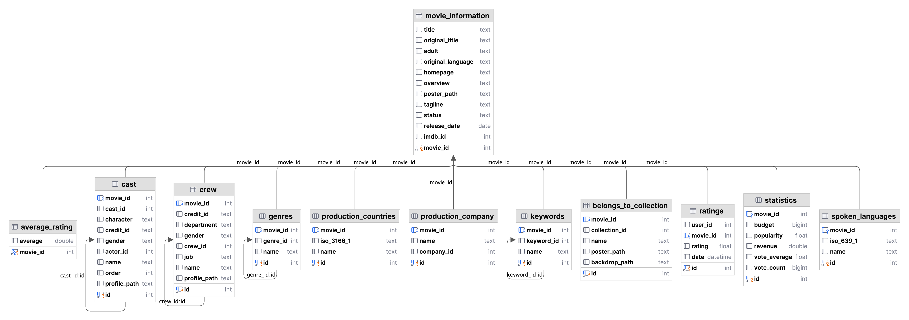

<!-- Improved compatibility of back to top link: See: https://github.com/othneildrew/Best-README-Template/pull/73 -->
<a name="readme-top"></a>
<!--
*** Thanks for checking out the Best-README-Template. If you have a suggestion
*** that would make this better, please fork the repo and create a pull request
*** or simply open an issue with the tag "enhancement".
*** Don't forget to give the project a star!
*** Thanks again! Now go create something AMAZING! :D
-->


<!-- PROJECT SHIELDS -->
<!--
*** I'm using markdown "reference style" links for readability.
*** Reference links are enclosed in brackets [ ] instead of parentheses ( ).
*** See the bottom of this document for the declaration of the reference variables
*** for contributors-url, forks-url, etc. This is an optional, concise syntax you may use.
*** https://www.markdownguide.org/basic-syntax/#reference-style-links
-->


<!-- PROJECT LOGO -->
<br />
<div align="center">
  <a href="https://github.com/GitQandil/mbc_training">
    
  </a>

<h3 align="center">MBC Training</h3>
  <p align="center">
    <a href="https://github.com/GitQandil/mbc_training/"><strong>Explore the docs »</strong></a>
    <br />
    <a href="https://github.com/GitQandil/mbc_training">View Demo</a>
    ·
    <a href="https://github.com/GitQandil/mbc_training/issues">Report Bug</a>
    ·
    <a href="https://github.com/GitQandil/mbc_training/issues">Request Feature</a>
  </p>
</div>


<!-- TABLE OF CONTENTS -->
<details>
  <summary>Table of Contents</summary>
  <ol>
    <li>
      <a href="#about-the-project">About The Project</a>
      <ul>
        <li><a href="#built-with">Built With</a></li>
      </ul>
    </li>
    <li>
      <a href="#getting-started">Getting Started</a>
      <ul>
        <li><a href="#prerequisites">Prerequisites</a></li>
      </ul>
    </li>
    <li><a href="#utilites">Utilites</a></li>
    <li><a href="#mysql-schema">MySQL Schema</a></li>
    <li><a href="#data-cleaning">Data Cleaning</a></li>
    <li><a href="#data-preprocessing">Data Preprocessing</a></li>
    <li><a href="#data-processing">Data Processing</a></li>
    <li><a href="#linting">Linting</a></li>
    <li><a href="#unit-testing">Unit Testing</a></li>
    <li><a href="#sql-tables-creation">SQL Tables Creation</a></li>
    <li><a href="#inserting-dataframes-to-database">Inserting DataFrames to Database</a></li>
    <li><a href="#docker-containerization">Docker Containerization</a></li>
  </ol>
</details>


<!-- ABOUT THE PROJECT -->
## About The Project

This Project applies multiple Data Engineering Concepts on the Movies Dataset on kaggle in order to create a database from multiple csv files and interconnect them for business reporting

These concepts include:

* EDA
* ETL
* Data Processing

<p align="right">(<a href="#readme-top">back to top</a>)</p>


### Built With


* [![Python][Python.py]][Python-url]
* [![MySQL][MySQL]][MySQL-url]
* [![Docker][Docker]][Docker-url]


<p align="right">(<a href="#readme-top">back to top</a>)</p>


<!-- GETTING STARTED -->
## Getting Started

This Projects needs MySQL and Python Installation

### Prerequisites

This is an example of how to list things you need to use the software and how to install them.
* Install Homebrew using your terminal by the below command
  ```sh
  /usr/bin/ruby -e "$(curl -fsSL https://raw.githubusercontent.com/Homebrew/install/master/install)"
  ```
* Install the latest version of a MYSQL database using brew, run:
  ```sh
  brew install mysql
  ```
* Run:
  ```sh
  mysql_secure_installation
  ```

* Install the latest version of a MYSQL database using brew, run:
  ```sh
  brew install mysql
  ```
  The procedure can take a while, but it gives a lot of power to make sure you get the best defaults out of the box

* Since we used brew services start mysql to start MySQL, your laptop will re-start it at reboot. You can run:
  ```sh
  brew services stop mysql
  ```
* To Start MYSQL
    ```sh
      brew services start mysql
    ```
* Install python3 on your local machine using the below command:
    ```sh
    brew install python
    ```
* Download The movies Dataset from kaggle

   [![Kaggle][Kaggle]][Kaggle-url]
* Context

    * These files contain metadata for all 45,000 movies listed in the Full MovieLens Dataset. 
    * The dataset consists of movies released on or before July 2017. Data points include cast, crew, plot keywords, budget, revenue, posters, release dates, languages, production companies, countries, TMDB vote counts and vote averages.
    * This dataset also has files containing 26 million ratings from 270,000 users for all 45,000 movies. Ratings are on a scale of 1-5 and have been obtained from the official GroupLens website.
    Content

* This dataset consists of the following files:

    * movies_metadata.csv: The main Movies Metadata file. Contains information on 45,000 movies featured in the Full MovieLens dataset. Features include posters, backdrops, budget, revenue, release dates, languages, production countries and companies.
    
    * keywords.csv: Contains the movie plot keywords for our MovieLens movies. Available in the form of a stringified JSON Object.
    
   *  credits.csv: Consists of Cast and Crew Information for all our movies. Available in the form of a stringified JSON Object.
    
    * links.csv: The file that contains the TMDB and IMDB IDs of all the movies featured in the Full MovieLens dataset.
    
    * links_small.csv: Contains the TMDB and IMDB IDs of a small subset of 9,000 movies of the Full Dataset.
    
    * ratings_small.csv: The subset of 100,000 ratings from 700 users on 9,000 movies.


## Utilites
Utilities python file was created that has UDF's in order to automate the proecess of data cleaning, processing, and preprocessing

## MySQL Schema
    create schema mbc_training

## Data Cleaning
Various Data Cleaning steps were done, such as filling nulls, removing duplicates, fixing data inconsistencies.
## Data preprocessing
The csv files contain Stringified JSON Columns, Each were exploded into their own DataFrame, where null structure was fixed and also keeping in mind each movie_id for foreign key purposes later on.
## Data Processing
The New DataFrames created were later inserted to the Database created
## Linting
Files were linted using pytest in order to check deployment quality insuring a score of 10/10
## Unit Testing
Each function created was unit tested with various test cases such as datatypes, functionality, and expected output
## SQL Tables Creation

<div align="center">
ERD
<br />
<br />

  <a href="https://github.com/GitQandil/mbc_training">
    
  </a>
</div>

* Belongs to Collection table

        create table belongs_to_collection
        (
        id            int  not null
        primary key,
        movie_id      int  null,
        collection_id int  null,
        name          text null,
        poster_path   text null,
        backdrop_path text null,
        constraint belongs_to_collection_movie_information_movie_id_fk
        foreign key (movie_id) references movie_information (movie_id)
        );
* Cast table

      create table cast
      (
      id           int  not null
      primary key,
      movie_id     int  null,
      cast_id      int  null,
      `character`  text null,
      credit_id    text null,
      gender       text null,
      actor_id     int  null,
      name         text null,
      `order`      int  null,
      profile_path text null,
      constraint cast_movie_information_movie_id_fk
      foreign key (movie_id) references movie_information (movie_id)
      );
* Crew table

      create table crew
      (
      id           int  not null
      primary key,
      movie_id     int  null,
      credit_id    text null,
      department   text null,
      gender       text null,
      crew_id      int  null,
      job          text null,
      name         text null,
      profile_path text null,
      constraint crew_movie_information_movie_id_fk
      foreign key (movie_id) references movie_information (movie_id)
      );
* Genres table

        create table genres
        (
        id       int  not null
        primary key,
        movie_id int  null,
        genre_id int  null,
        name     text null,
        constraint genres_movie_information_movie_id_fk
        foreign key (movie_id) references movie_information (movie_id)
        );

* keywords table

        create table keywords
        (
        id         int  not null
        primary key,
        movie_id   int  null,
        keyword_id int  null,
        name       text null,
        constraint keywords_movie_information_movie_id_fk
        foreign key (movie_id) references movie_information (movie_id)
        );
* Movie Information Table

        create table movie_information
        (
        movie_id          int  not null
        primary key,
        title             text null,
        original_title    text null,
        adult             text null,
        original_language text null,
        homepage          text null,
        overview          text null,
        poster_path       text null,
        tagline           text null,
        status            text null,
        release_date      date null,
        imdb_id           int  null
        );

* Production Companies Table

      create table production_company
      (
      id         int  not null
      primary key,
      movie_id   int  null,
      name       text null,
      company_id int  null,
      constraint production_company_movie_information_movie_id_fk
      foreign key (movie_id) references movie_information (movie_id)
      );
* Production Countries

        create table production_countries
        (
        id         int  not null
        primary key,
        movie_id   int  null,
        iso_3166_1 text null,
        name       text null,
        constraint production_countries_movie_information_movie_id_fk
        foreign key (movie_id) references movie_information (movie_id)
        );

* Ratings

      create table ratings
      (
      id       int      not null
      primary key,
      user_id  int      null,
      movie_id int      null,
      rating   float    null,
      date     datetime null,
      constraint ratings_movie_information_movie_id_fk
      foreign key (movie_id) references movie_information (movie_id)
      );
* Spoken Languages

        create table spoken_languages
        (
        id        int  not null
        primary key,
        movie_id  int  null,
        iso_639_1 text null,
        name      text null,
        constraint spoken_languages_movie_information_movie_id_fk
        foreign key (movie_id) references movie_information (movie_id)
        );


* Statistics

      create table statistics
      (
      id           int    not null
      primary key,
      movie_id     int    null,
      budget       bigint null,
      popularity   float  null,
      revenue      double null,
      vote_average float  null,
      vote_count   bigint null,
      constraint statistics_movie_information_movie_id_fk
      foreign key (movie_id) references movie_information (movie_id)
      );

## Inserting DataFrames to Database
The DataFrames were inserted to the tables created
## Docker Containerization


<p align="right">(<a href="#readme-top">back to top</a>)</p>


<!-- CONTACT -->
## Contact

Your Name - [@your_twitter](https://twitter.com/your_username) - email@example.com

Project Link: [https://github.com/your_username/repo_name](https://github.com/your_username/repo_name)

<p align="right">(<a href="#readme-top">back to top</a>)</p>


<!-- ACKNOWLEDGMENTS -->
## Acknowledgments

Use this space to list resources you find helpful and would like to give credit to. I've included a few of my favorites to kick things off!

* [Choose an Open Source License](https://choosealicense.com)
* [GitHub Emoji Cheat Sheet](https://www.webpagefx.com/tools/emoji-cheat-sheet)
* [Malven's Flexbox Cheatsheet](https://flexbox.malven.co/)
* [Malven's Grid Cheatsheet](https://grid.malven.co/)
* [Img Shields](https://shields.io)
* [GitHub Pages](https://pages.github.com)
* [Font Awesome](https://fontawesome.com)
* [React Icons](https://react-icons.github.io/react-icons/search)

<p align="right">(<a href="#readme-top">back to top</a>)</p>


[Python.py]: https://img.shields.io/badge/python-3670A0?style=for-the-badge&logo=python&logoColor=ffdd54
[Python-url]: https://www.python.org
[Docker]: https://img.shields.io/badge/docker-%230db7ed.svg?style=for-the-badge&logo=docker&logoColor=white
[Docker-url]: https://www.docker.com/
[MySQL]: https://img.shields.io/badge/mysql-%2300f.svg?style=for-the-badge&logo=mysql&logoColor=white
[MySQL-url]: https://www.mysql.com/
[Kaggle-url]: https://www.kaggle.com/datasets/rounakbanik/the-movies-dataset
[Kaggle]:https://img.shields.io/badge/Kaggle-035a7d?style=for-the-badge&logo=kaggle&logoColor=white